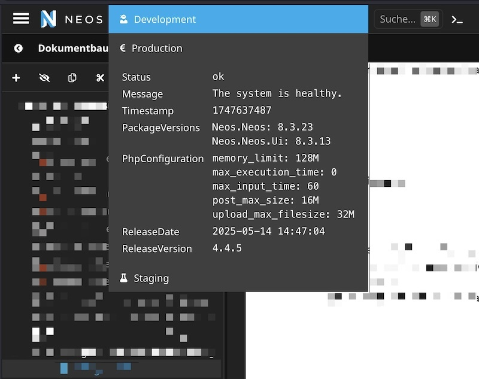

# Healthcheck endpoint for Neos CMS

This package provides a healthcheck endpoint for Neos CMS and a UI integration for the Neos backend.

This should help with monitoring and checking the health of your Neos installations.
The backend integration allows to quickly check customizable details about the various environments
of the application, f.e. local dev, staging and production.

## Installation

Install the package via composer:

```console
composer require shel/neos-healthcheck
```

## Example of backend integration

[](HealthCheckExample.jpg)

## Example output of the endpoint

The package includes various implementations of the `Shel\Neos\HealthCheck\Checks\HealthCheckInterface` 
which are executed when the endpoint is called.
In addition several of them provide configuration options to customize their behavior.

```json
{
    "status": "ok",
    "message": "The system is healthy.",
    "timestamp": 1747112482,
    "packageVersions": {
        "Neos.Neos": "8.3.23",
        "Neos.Neos.Ui": "8.3.13"
    },
    "releaseDate": "2025-05-13 06:39:00",
    "releaseVersion": "5.4.1",
    "phpConfiguration": {
        "memory_limit": "4096M",
        "max_execution_time": "0",
        "max_input_time": "60",
        "post_max_size": "200M",
        "upload_max_filesize": "200M"
    }
}
```

## Accessing the endpoint

The JSON endpoint `/healthcheck` is secured by default, so you need to provide a mechanism to authenticate the request. 

The recommended way is to install the package 
[flownative/token-authentication](https://github.com/flownative/flow-token-auth) and create a token for the 
role `Shel.Neos.HealthCheck:Client`:

Run 
```console
./flow hashtoken:createhashtoken --roleNames Shel.Neos.HealthCheck:Client
```

This will create a token which you can use to authenticate the request either as request argument 
`_authenticationHashToken=<myToken>` or as Authorization header with the value `Bearer <myToken>`.

## Configuration

You can configure some of the individual checks in your `Settings.yaml` file.
See [Configuration/Settings.HealthChecks.yaml](Configuration/Settings.HealthChecks.yaml) for the available options.

### UI integration configuration

It is recommended to either only configure the ui integration in the development context 
or have an environment specific configuration for each context.
Also don't commit the hashed tokens to your repository which are required for the integration
to access the various systems.

## License

See the [LICENSE.txt](LICENSE.txt) file for details.
